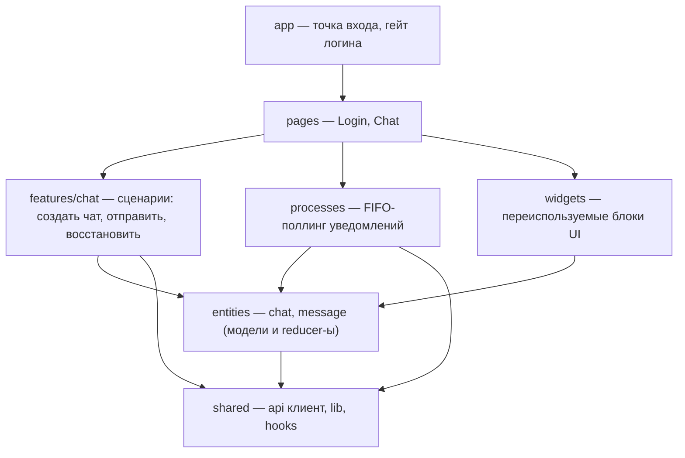

# MAX Chat

Веб-клиент мессенджера [MAX](https://web.max.ru/) на базе [GREEN-API](https://green-api.com/max).

Чистый React без бэкенда: весь проект — это фронтенд, который общается с GREEN-API
напрямую из браузера (как их официальный HTML SDK). Именно поэтому в README нет
раздела про сервер: его здесь нет.

> Тестовое задание. Интерфейс повторяет минимальную идею web.max.ru: список чатов слева,
> лента сообщений и поле ввода справа.

---

## Возможности

- **Отправка текстовых сообщений** в MAX через `SendMessage` — мгновенно, с оптимистичным
  отображением (статусы «Отправка…» / ✓ / «Не отправлено»);
- **Приём входящих** через HTTP API: FIFO-поллинг `receiveNotification` + `deleteNotification`;
- **Автовосстановление диалогов**: открытые чаты (id/телефон/имя) хранятся в `sessionStorage`
  и поднимаются при перезагрузке страницы;
- **История сообщений** при загрузке — `GetChatHistory` (последние 100 сообщений на чат);
- **Дружелюбные ошибки**: квоты тарифа «Разработчик» (466), rate limit (429), CORS,
  «забытый» webhookUrl в кабинете — всё превращается в понятный текст, а не голый код;
- **Только текст** — по условию задания приложение фильтрует не-текстовые сообщения ещё на входе;
- **Безопасность по умолчанию**: креды живут только в `localStorage`, список чатов — в
  `sessionStorage`, история не сохраняется на диск (берётся из API при каждом входе).

---

## Стек

| Компонент              | Что это                                            |
| ---------------------- | -------------------------------------------------- |
| React 18 + Vite 5      | Сборка и UI, без UI-фреймворков и TypeScript       |
| GREEN-API (MAX)        | Мессенджер-провайдер: HTTP API для отправки/приёма |
| node:test (встроенный) | Тесты — без тест-фреймворка, `node --test`         |

---

## Быстрый старт

```bash
npm install
npm run dev        # http://localhost:5173
```

Продакшен-сборка и тесты:

```bash
npm run build
npm test           # node --test, авто-поиск test/**/*.test.mjs
```

## Как пользоваться

1. **Вход.** Введите `idInstance` и `apiTokenInstance` из личного кабинета
   console.green-api.com (инстанс MAX должен быть авторизован — проверяется
   через `getStateInstance`).
2. **Новый чат.** Введите номер собеседника (например, `89991234567`). Приложение
   проверит номер через `CheckAccount` и создаст чат — присвоив ему **числовой chatId** MAX
   (см. «Ключевые решения»). Номер должен быть зарегистрирован в MAX (РФ/РБ).
3. **Отправка.** Напишите сообщение и нажмите Enter. Собеседник увидит его в MAX,
   его ответ появится в чате автоматически (поллинг раз в 1.5 с).
4. **Перезагрузка.** Открытые чаты восстановятся из `sessionStorage`: имена обновятся через
   `getContactInfo`, история подгрузится через `GetChatHistory` (~1.2 с между чатами,
   чтобы не упереться в лимит 1 запрос/с).

---

## Архитектура — Feature-Sliced Design

Проект организован по методологии [FSD (Feature-Sliced Design)](https://feature-sliced.design/):
код делится на **слои**, и зависимости разрешены только **сверху вниз** — страница может
использовать фичу, но не наоборот.



| Слой             | Содержимое                                                          | Что здесь решается                           |
| ---------------- | ------------------------------------------------------------------- | -------------------------------------------- |
| `app/`           | Точка входа, роутинг «Login ↔ Chat», выход из аккаунта              | Где лежат креды, какую страницу показать     |
| `pages/`         | `LoginPage`, `ChatPage` — состояние сессии и композиция виджетов    | _Что показано на экране сейчас_              |
| `processes/`     | `notification-poll` — фоновый FIFO-поллинг входящих                 | _Как вообще принимаются сообщения_           |
| `features/chat/` | Сценарии: `openChatByPhone`, `sendText`, `refreshSavedChat`         | _Как создать чат / отправить / восстановить_ |
| `entities/`      | Модели: chat (список), message (парсинг вебхуков и истории)         | _Что такое «чат» и «сообщение»_              |
| `widgets/`       | UI-блоки: `ChatList`, `MessageList`, `Composer`, баннеры…           | _Как выглядит чат на экране_                 |
| `shared/`        | API-клиент GREEN-API, утилиты (phone, chatId, storage, sleep), хуки | _Нижний кирпичик: сеть и инструменты_        |

**Правила, которым следует проект:**

- страницы не ходят в API напрямую — только через сценарии фичи (`features/chat`);
- фичи не знают про React-стейт — состояние обновляется через reducers из `entities`
  (все они чистые функции);
- процессы не знают про UI — только эмитят события (`onMessage`, `onQuota`, …);
- у `shared` нет зависимостей выше по слоям;
- тесты раскладываются зеркально структуре `src/`, поэтому каждый слой проверен независимо.

### Структура проекта

```
src/
├── main.jsx                      # точка монтирования React (StrictMode)
├── styles.css                    # дизайн-токены + вся вёрстка
├── app/
│   └── index.jsx                 # App: гейт логина, роутинг, logout
├── pages/
│   ├── login/index.jsx           # страница входа (idInstance + token)
│   └── chat/index.jsx            # страница чата: состояние, рестор, поллинг
├── processes/
│   └── notification-poll/
│       └── index.js              # useNotificationPoll: FIFO-цикл приёма
├── features/
│   └── chat/
│       ├── actions.js            # openChatByPhone, sendText
│       └── restore.js            # refreshSavedChat: имя + история (1.2 с/чат)
├── entities/
│   ├── chat/index.js             # appendChat, mergeRestored, mergeHistory...
│   └── message/index.js          # extractTextMessage, historyToMessages...
├── widgets/
│   ├── chat-list/                # список чатов слева
│   ├── chat-item/                # строка списка (имя + последнее сообщение)
│   ├── message-list/             # лента сообщений
│   ├── message-bubble/           # один пузырь сообщения
│   ├── composer/                 # поле ввода (черновик не теряется при ошибке)
│   ├── new-chat-form/            # форма создания чата по номеру
│   └── error-banner/             # баннер ошибок/предупреждений
└── shared/
    ├── api/green-api.js          # HTTP-клиент GREEN-API + квоты/ошибки
    ├── lib/
    │   ├── phone.js              # normalizePhone (8→7, 10 цифр)
    │   ├── chat-id.js            # withChatSuffix / withoutChatSuffix
    │   ├── chats-storage.js      # sessionStorage: load/save/clear
    │   └── sleep.js              # пауза между запросами
    └── hooks/use-auto-scroll.js  # автопрокрутка только активного чата
test/
├── api/*.test.mjs                # URL/методы/тела, квоты, FIFO, нормализация
├── entities/*.test.mjs           # модель чата и сообщения
├── features/chat.test.mjs        # сценарии фичи (с мок-API)
└── lib/*.test.mjs                # утилиты: phone, chatId, storage
```

---

## Ключевые решения

### chatId — числовой id аккаунта, а не телефон

В MAX адрес собеседника это **не номер телефона**, а числовой идентификатор аккаунта
(`10000000@c.us`). Поэтому при создании чата телефон сперва прогоняется через
`CheckAccount`, и только полученный id используется для отправки. Отправка на
«телефон как chatId» приводит к ошибке `noAccount` во входящем вебхуке.

### Приём сообщений: FIFO-поллинг

Схема (HTTP API, как в [официальной доке](https://green-api.com/v3/docs/api/receiving/receiveNotification/)):

```
receiveNotification → разобрать → применить → deleteNotification
```

Уведомление удаляется из очереди **только после успешной обработки** — при сбое
GREEN-API отдаст его снова, а дедупликация по `idMessage` сделает повтор безвредным.

### Квоты тарифа «Разработчик» и 466

Developer-тариф ограничен месячной квотой: лимиты по методам (`invokeStatus`) и по
**числу чатов** (`correspondentsStatus`, по умолчанию 3 чата/мес). При исчерпании
API отвечает **466** и/или шлёт вебхук `quotaExceeded`. Приложение показывает это
понятным сообщением — и, важно, **не сбрасывает баннер квоты** сразу после показа.

### sessionStorage: только «оглавление» диалогов

Сохраняем `{chatId, title, phone}` — без сообщений. История берётся из API при
каждом входе (`GetChatHistory`), поэтому в sessionStorage не копится устаревший
контент, и сообщения не «протухают».

### StrictMode и идемпотентность

В dev включён `StrictMode`, который монтирует компоненты дважды. Все фоновые
задачи (рестор, поллинг) спроектированы так, чтобы повторный запуск был безвреден:
reducers в `entities` чистые и дедуплицируют (по `chatId`, `idMessage`), а ремап
chatId в ресторе синхронизируется с активным чатом.

### Почему нет TypeScript и алиасов типа `@/`

Тесты запускаются **plain node** (`node --test`) — без Vite и без сборки. Поэтому
в проекте используются явные относительные импорты с расширениями (`.js`/`.jsx`):
это единственный способ, чтобы одни и те же модули работали и в браузере, и в node.
Подключение алиасов потребовало бы дублировать конфиг для node — осознанный обмен
нескольких `../` на «ноль сборки при тестах».

---

## Тестирование

```bash
npm test
```

33 теста на встроенном `node:test` (без фреймворка) покрывают:

- **API-клиент**: правильные URL/метод/тело каждого вызова, нормализация ответов,
  двойное JSON-кодирование вебхуков, квоты 466, rate limit 429, 401/403, сетевые сбои;
- **Сущности**: reducer-ы чатов (создание, восстановление, дедуп, сортировка
  истории), парсинг вебхуков и истории, локальное сообщение в секундах;
- **Фичу chat**: сценарии «создать чат», «отправить» (успех/ошибка/пустой ввод),
  «восстановить чат» (имя+история, фолбэк на checkAccount, тихий сбой квоты) — всё
  на мок-API;
- **Утилиты**: нормализация телефона, `@c.us`-суффиксы, sessionStorage (round-trip,
  битые данные, разграничение по idInstance).

---

## Ограничения и нюансы

- **Rate limit `GetChatHistory` — 1 запрос/с.** История открытых чатов грузится
  последовательно с паузой 1.2 с. При 429 пропустим историю тихо: живые сообщения
  всё равно придут через поллинг.
- **CORS.** Прямой fetch из браузера — осознанное решение без бэкенда (так работает
  официальный HTML SDK). Если API отвечает 403 на Origin — добавьте домен приложения
  (например, `http://localhost:5173`) в разрешённые origin-ы инстанса в кабинете.
  В крайнем случае в `vite.config.js` есть готовый dev-прокси (см. ниже).
- **webhookUrl в кабинете.** Если в настройках инстанса задан custom webhookUrl,
  `receiveNotification` отвечает 400 — приложение объяснит, что делать.
- **Только текст.** Приложение фильтрует не-текстовые сообщения на входе (по условию
  задания из фильма про MAX: «только текстовые сообщения»).

### Dev-прокси (на случай жёсткого CORS)

```js
// vite.config.js
server: {
  proxy: {
    "/api": {
      target: "https://api.green-api.com",
      changeOrigin: true,
      rewrite: (p) => p.replace(/^\/api/, ""),
    },
  },
},
```

…и заменить `API_URL` в `src/shared/api/green-api.js` на `"/api"`.

---

## Roadmap (что можно докрутить дальше)

- Медиа и файлы (`typeMessage` `imageMessage`, `documentMessage`) + превью;
- статусы «доставлено/прочитано» для исходящих (вебхуки `outgoingMessageReceived`);
- индикатор непрочитанных и звуковой сигнал;
- поиск по чатам и сообщениям;
- тёмная тема через design-tokens в `styles.css`;
- автообновление списка чатов (`getChats`) вместо только рестор-имён.

---

## Ссылки

- [GREEN-API — MAX](https://green-api.com/max) — продукт и тарифы
- [Документация API](https://green-api.com/v3/docs/) — все методы, контракты, примеры
- [Личный кабинет](https://console.green-api.com) — idInstance/apiTokenInstance, тариф, настройки
- [FSD — Feature-Sliced Design](https://feature-sliced.design/) — методология организации кода
